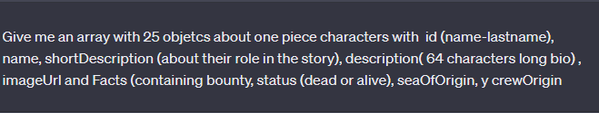
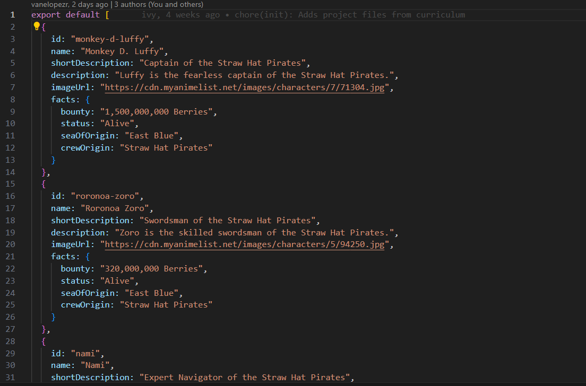
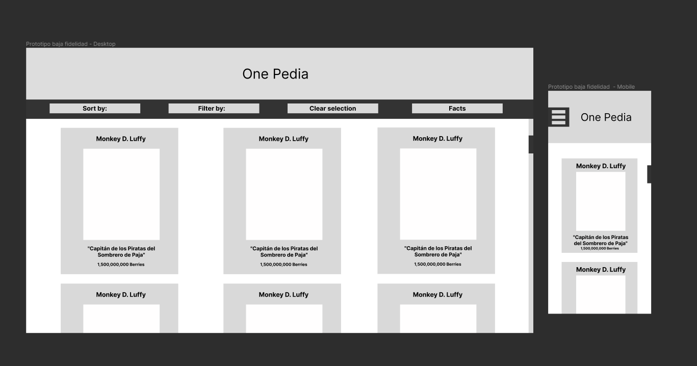
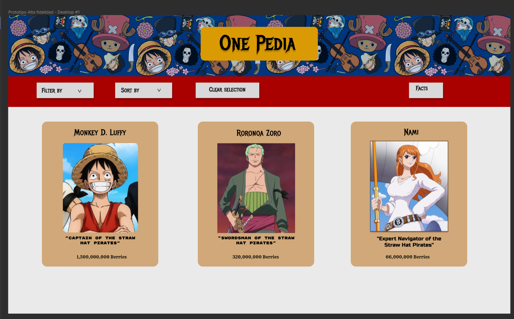
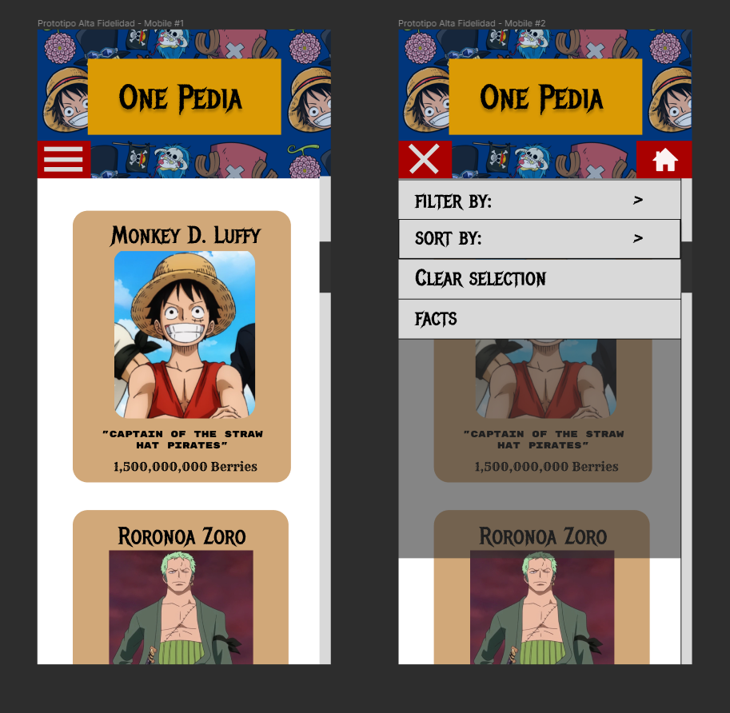
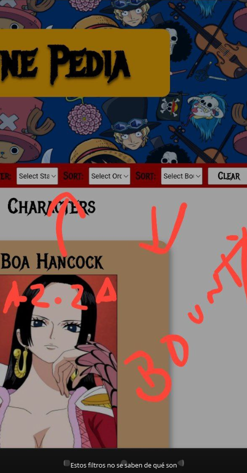

# Dataverse

# Preámbulo del desarrollo

Este proyecto ha sido desarrollado bajo el marco de aprendizaje del bootcamp de Laboratoria. Como segundo proyecto en duplas, tiene la finalidad de enzeñarnos a cómo manipular de manera más dinámica el DOM mediante la **creación de elementos HTML mediante el uso de Javascript**. También, a trabajar con una **base de datos** y aprender a **filtrar y arreglar** elementos de esa BBDD para poder disponer de su información en la manera en la que se necesite. 

***

# Creación de la data mediante uso de IA

El proyecto también incluye una parte muy escencial para el futuro del desarrollo de páginas web mediante la introducción de **Inteligencias Artificiales** que nos ayudaron a crear la base de datos con la cual estaríamos trabajando mediante el **prompting**. 

Un ejemplo de las directrices entregadas a la IA de ChatGPT fue la siguiente: 

Se le dio una serie de instrucciones teniendo en cuenta la estructura que queríamos que tuviera la base de datos. Era un arreglo de ojetos con diferentes valores, que adicionalmente, tendría otro objeto con más parámetros dentro. Al ver que no nos dio toda la data solicitada, pasamos a pedirle que nos diera 16 elementos adicionales.

La data que nos pasó la IA quedó dispuesta de esta manera: 

***

# Historias de usuarias 

Nos enfocamos en diversos problemas generados por usuarias que interactuarían con nuestra página y velamos que, a través de esas historias, se diera uso a cada uno de los componentes que conforman la interactividad de la página. Estas historias las fuimos dejando en Trello como guía para la planificación de las tareas durante los sprints. Un ejemplo de estas historias es la siguiente:

Kiriko fan de One Piece:

Quiero: Verificar que la información de la página esté acorde a mis conocimientos y quiero verificar que esté toda la información respecto a los personajes en la página.

Para: confirmar que sea un recurso de información confiable.

***

# Diseño de la página

Para el diseño, nos enfocamos en trabajar con un modelo de baja fidelidad el cual se fue construyendo con un esquema inicial que fue modificado al pedir feedback a nuestras compañeras.

En el diseño de alta fidelidad, se siguió el mismo principio. Decidimos trabajar con un esquema de colores que se ajustara a los que se utilizan en las portadas del manga de *One Piece** y, siguiendo esta filosofía para el diseño, las tarjetas que muestran la información se parecen a los **Bounty** posters del mismo anime dando el resultado final de la página.

El diseño que se planificó para la versión de teléfonos, por diversos motivos, no quedó con relación 1:1 a lo detallado en figma ya que presentamos algunos problemas con el menú de hamburguesa.

***

# Problemas detectados en tests de usabilidad

Durante uno de los deploy que realizamos para ir buscando feedback de usuarias, se nos hizo ver la falta de claridad al momento de seleccionar las opciones de los filtros/sort. 

Otro de los problemas encontrados durante las pruebas con usuarios del producto casi terminado fue el limpiar el resto de los filtros y dejar solo el seleccionado para dar claridad sobre cuál era el filtro que está en uso.

***

